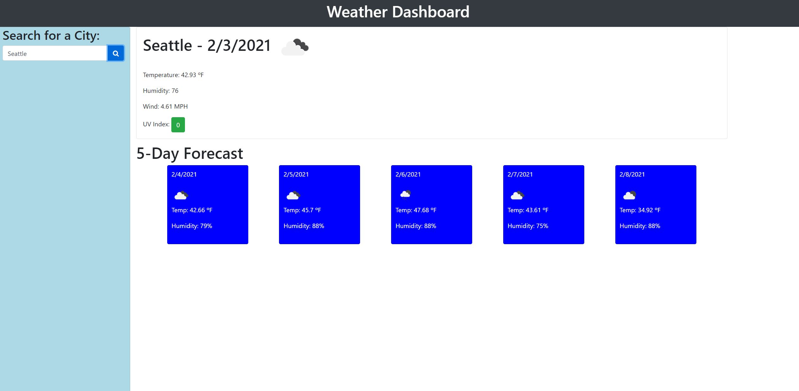
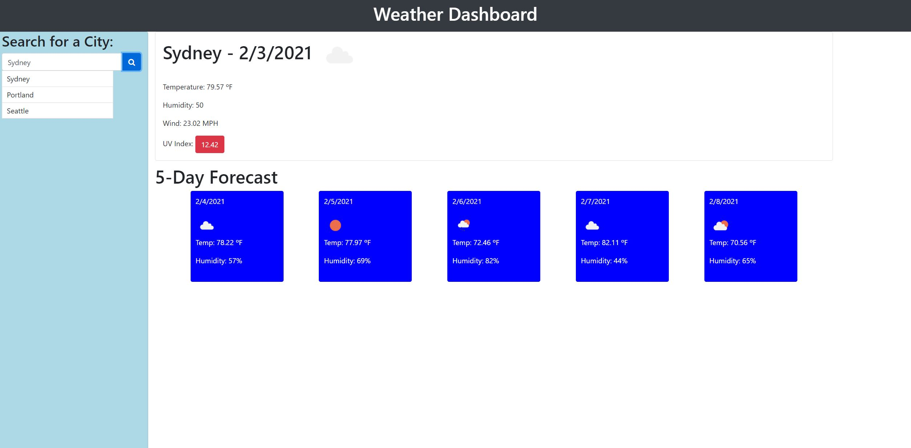

# Weather Dashboard

## Project Description
I wanted to create a weather dashboard that would display both the current weather and the five day forecast for a searched city. The Open Weather API was used to pull and display the city weather information. The UV index also gives you a color coded warning based on the severity level of the index. The user's search history is then saved in local storage. 

## Technologies Used
* HTML5
* CSS
* Bootstrap
* JavaScript
* JQuery
* Open Weather API

## Process

I started by building the site HTML and CSS. Two divs were also built to eventually hold the current weather and the five day forecast. I used the grid system built into bootstrap to lineup the rows and columns of information. 

After that was finished, I set up the fetch for the current weather. I didn't style it, I just wanted to get the information on the page. 

I worked in a study group with my fellow classmates to set up local storage. The shortcut I learned at the top of the code to either set the cities to the array of saved or null was a new method I never would've thought of. Before that I would always make an if/else statement. 

After I got that to work I added the five day forecast. Initially I used JQuery to add the data into an HTML element. My tutor then introduced me to template literals. That was not only easier, but also saved me a lot of lines of code. My tutor also helped me set up the loop to put the forecast cards into the div.

There was a scoping problem I had to fix at this time for the UV index. The problem was I initially had my UV index in a separate function because I didn't know I could include multiple API fetches in one function. I then added the .includes method onto the array of city history in the saveCitySearch function so I wouldn't display repeat cities. To add the bootstrap button color to the UV index based on the severity level I added was to use an if, else if, else statment.

Right when I thought the project was completed I realized I was missing one major feature. I forgot to include the ability to search using the past search history. I created another event listener on each list item using the jquery on click of "li" for the list item. That was advice I got from one of my classmates in my study group. Initially it did not work so I had to break apart the functions I had under the event listener and add the correct parameters to get them to run correctly. 

My final JavaScript change was adding my displayCitySearch function to the initial search event listener. Before, the history would only show after you refreshed the page. Now the history updates once you click the search button. 

Overall this was a challenging assignment but I now understand how to use APIs not only effectively but in tandem with one another.

## Project Link
[Deployed Link](https://mikecoletta.github.io/Weather-Dashboard/)

## Screenshots

## Credits
Creating a search input with button (https://stackoverflow.com/questions/45696685/search-input-with-an-icon-bootstrap-4)

UV index scale (https://www.epa.gov/sunsafety/uv-index-scale-0)

## License
The MIT License (MIT)

Copyright (c) 2021 Mike Coletta

Permission is hereby granted, free of charge, to any person obtaining a copy of this software and associated documentation files (the "Software"), to deal in the Software without restriction, including without limitation the rights to use, copy, modify, merge, publish, distribute, sublicense, and/or sell copies of the Software, and to permit persons to whom the Software is furnished to do so, subject to the following conditions:

The above copyright notice and this permission notice shall be included in all copies or substantial portions of the Software.

THE SOFTWARE IS PROVIDED "AS IS", WITHOUT WARRANTY OF ANY KIND, EXPRESS OR IMPLIED, INCLUDING BUT NOT LIMITED TO THE WARRANTIES OF MERCHANTABILITY, FITNESS FOR A PARTICULAR PURPOSE AND NONINFRINGEMENT. IN NO EVENT SHALL THE AUTHORS OR COPYRIGHT HOLDERS BE LIABLE FOR ANY CLAIM, DAMAGES OR OTHER LIABILITY, WHETHER IN AN ACTION OF CONTRACT, TORT OR OTHERWISE, ARISING FROM, OUT OF OR IN CONNECTION WITH THE SOFTWARE OR THE USE OR OTHER DEALINGS IN THE SOFTWARE.
